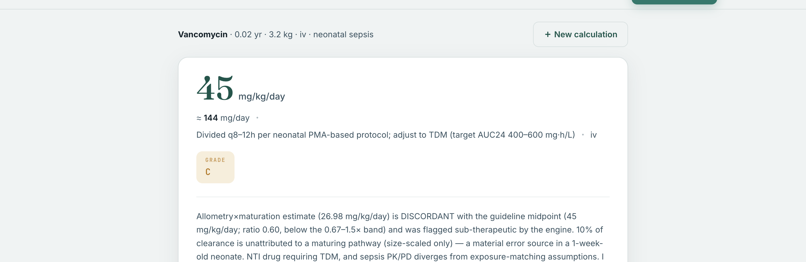

# PaedScale


### A pediatric dose, extrapolated from adult pharmacokinetics — with a cited, graded, auditable rationale.

PaedScale derives a defensible **starting** dose for a child from published adult PK, using
**allometry × organ maturation** (Anderson–Holford), and returns a graded A→D recommendation with the
reasoning, the guideline concordance, and every uncertainty made explicit — not a black-box number.

> **Medication errors harm an estimated 1.5 million people a year in the United States alone**, and
> children are disproportionately exposed — because nearly every pediatric dose is a weight-based
> calculation done by hand, for a body whose organs are still maturing.
> <br><sub>Sources: Institute of Medicine, *Preventing Medication Errors* (2006); Kaushal et al., *JAMA* 2001;285:2114 (pediatric medication-error rate).</sub>


<sub>A real graded run: clindamycin, 6 yr — the estimate, the grade, the guideline concordance (1.14×), and the flags, all in one auditable view.</sub>

---

## Why pediatric dosing is hard — and where guidelines run out

Drug clearance does **not** scale linearly with body size in early life: the organs that eliminate the
drug are still maturing, so scaling an adult dose by weight **over-doses the young.** Published pediatric
labels cover the common drug × age combinations — but they *run out* for neonates, off-label drugs,
organ impairment, and narrow-therapeutic-index agents, where clinicians today extrapolate by hand from
sparse references.

PaedScale encodes the distance between the naïve weight-linear line and the true maturation curve, and —
the whole point — maps each drug to its elimination pathway so a single deterministic engine extrapolates
**across the drug space** without a hardcoded per-drug lookup table.

## What makes it more than an LLM wrapper

- **Multi-agent by design** — an **Opus orchestrator** (`agents/agent.py`) drives a cheaper **Sonnet
  retrieval subagent** (`retrieval/`) that gathers cited adult PK **live from PubMed + openFDA**.
- **Python does the arithmetic; Claude does the judgment** — a deterministic engine does the math; the
  model maps drug → pathway → maturation curve and writes the justification. The mapping across the drug
  space is what a hardcoded calculator cannot do.
- **Cite-or-abstain, enforced in code** — the engine *raises* rather than invent a maturation curve for an
  unknown pathway, and *flags* unattributed clearance instead of hiding it. No unsourced PK value drives a
  confident point estimate — it grades **D** and abstains instead.
- **Organ function, from real inputs** — renal impairment derives its clearance modifier from a **bedside
  Schwartz eGFR** (serum creatinine + height), not a flat guess; hepatic adjustment is surfaced as a
  drug-specific note rather than a silent reduction.
- **MCP server** (`api/mcp_server.py`) exposes the same retrieval tools over FastMCP (stdio).

## See it reason — including when it *shouldn't* be confident

The differentiator isn't a confident number; it's a number that knows its own limits.

| Confident & concordant | Honest under uncertainty |
|---|---|
|  |  |
| Clindamycin — clean CYP3A4 pathway, concordant with the guideline (1.14×) → **grade A**. | Neonatal vancomycin — a narrow-TI renal drug where allometry under-predicts; it flags the discordance, recommends TDM, anchors to the guideline, and caps the grade at **C**. |

## The science

Per elimination pathway:

```
CL_child = CL_adult × (WT/70)^0.75 × MF(PMA) × OF
MF(PMA)  = PMA^H / (TM50^H + PMA^H)      # maturation, normalised so adult ≈ 1
```

`WT` weight (kg) · `PMA` postmenstrual age (weeks) · `TM50` age at 50% maturation · `H` Hill coefficient ·
`OF` organ-function modifier (renal from Schwartz eGFR / hepatic). Vd scales linearly; the dose is solved
by the effect-driving metric (`css`/`auc` for maintenance, `cmax` for peaks, `time_mic` flagged as a proxy
for β-lactams). Oral doses are corrected by bioavailability `F`; toxic/effective bounds fire a prominent
safety warning.

<sub>Allometric ¾-power scaling and sigmoidal maturation: Anderson & Holford, *Annu. Rev. Pharmacol. Toxicol.* 2008;48:303. GFR maturation model: Rhodin et al., *Pediatr. Nephrol.* 2009;24:67. Bedside eGFR: Schwartz et al., *J. Am. Soc. Nephrol.* 2009;20:629.</sub>

## Grading & concordance

| Grade | Meaning |
|-------|---------|
| **A** | Passes concordance vs a real published guideline |
| **B** | Solid PK, no guideline to check against |
| **C** | Sparse / uncertain — directional only |
| **D** | Insufficient data or a safety stop (dose withheld) |

Concordance = the estimate vs a guideline dose, reported as a ratio inside a **0.67×–1.5× band**.
Deterministic validation across the seeded archetypes:

```
midazolam    est=  1.91  guideline=  1.44  ratio=1.33  PASS
vancomycin   est= 39.04  guideline= 60.00  ratio=0.65  CHECK
morphine     est=  0.63  guideline=  0.48  ratio=1.31  PASS
gentamicin   est=  5.00  guideline=  7.00  ratio=0.71  PASS
amikacin     est= 15.00  guideline= 19.00  ratio=0.79  PASS
fentanyl     est=  0.05  guideline=  0.05  ratio=1.00  PASS
ampicillin   est=156.16  guideline=150.00  ratio=1.04  PASS
clindamycin  est= 34.17  guideline= 30.00  ratio=1.14  PASS
→ 7/8 within band
```

The two "misses" are **by design and self-reported**: vancomycin is narrow-TI (recommend TDM) and
aminoglycosides are known to underdose under allometry×Cmax — the agent surfaces this `engine_limitation`
rather than hiding it. Knowing where it fails is a feature.

## Architecture

```
frontend/index.html          self-contained UI (form → /calculate/stream → graded result + chat)
backend/                     run all commands from here (backend/ is the package root)
  engine/                    deterministic backbone — no I/O, no LLM
    constants.py             MATURATION params (TM50/Hill) ONLY. NO per-drug PK.
    pk_engine.py             allometry × maturation, dose solve, oral-F, safety, Schwartz eGFR → OF
    edge_cases.py            deterministic flags: prodrug / obesity / protein-binding / illness
    pk_cache.py              bounded in-process LRU for live dossiers
    mechanism_score.py       mechanistic-reasoning scorer (6 dimensions)
  retrieval/                 retrieval subagent + tools (import retrieval → __init__.py)
    __init__.py              RETRIEVAL SUBAGENT (Sonnet) → cited dossier, cache hit, or abstain
    retrieval_tools.py       httpx: PubMed E-utilities + openFDA + web_fetch
  agents/agent.py            Opus ORCHESTRATOR: load_skill → retrieve → compute → edge_cases → grade
  api/main.py                FastAPI: /, /calculate, /calculate/stream, /chat, /pk, /health
  api/mcp_server.py          MCP server for the same retrieval tools (FastMCP, stdio)
  tests/                     test_pk.py (no key) / test_agent.py (key + network)
  skills/                    lean markdown skills loaded on demand
  eval_data/                 ANSWER KEYS ONLY — harness, never the product path
```

**No hardcoded per-drug PK in the product path.** The agent retrieves adult PK live (PubMed + openFDA),
serves a TTL-bounded cache hit, or **abstains** (grade D). `eval_data/` is harness-only.

## Run

```bash
cd backend                         # backend/ is the package root — run everything from here
python3 -m venv .venv && source .venv/bin/activate
pip install -r requirements.txt
python3 -m tests.test_pk           # deterministic core + scorers — NO key needed
cp .env.example .env               # ANTHROPIC_API_KEY (+ optional OPENFDA_API_KEY / NCBI_API_KEY)
uvicorn api.main:app --reload --port 8000
# open http://localhost:8000
python3 -m tests.test_agent        # end-to-end eval (needs key + network)
python3 -m api.mcp_server          # optional: the retrieval MCP server (stdio)
```

`/pk` and `tests/test_pk` run **without a key**. `/calculate`, the orchestrator and the retrieval subagent
need the key **and network** (live PubMed/openFDA); expect ~60–95 s/query for the full live path.

## Where it's headed

From one maturation curve per pathway to a **physiologically-based PK (PBPK) "digital twin"** of the
child — validated against real clinical concentrations, then personalised to the patient's genotype and
measured organ function. This is the path from careful extrapolation to **individualised pediatric dosing.**

## Disclaimer

PaedScale is a research prototype. Its output is a defensible **starting estimate** for a qualified
clinician — not an autonomous order, and not a validated clinical-decision-support device.
Narrow-therapeutic-index drugs require therapeutic drug monitoring.

## License

[MIT](LICENSE).
