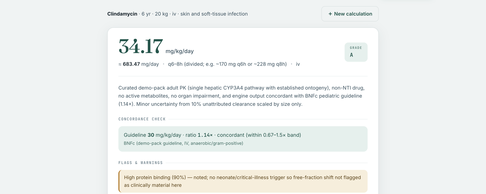

# PaedScale

**Pediatric dose-extrapolation agent.** PaedScale derives a defensible *starting* dose for a
child from published adult pharmacokinetics, using **allometry × organ maturation**
(Anderson–Holford), and returns a graded, cited, auditable rationale.

> ⚕️ **Decision support, not prescribing.** PaedScale proposes a *starting* estimate with its
> uncertainty made explicit — it does not replace clinical judgment, TDM, or a prescriber.

Built for the **2026 Claude: Life Sciences Hackathon** (Builder track).

---

## Why

Drug clearance does **not** scale linearly with body size in early life — the organs that
eliminate the drug are still maturing. Scaling an adult dose by weight *over-doses the young*.
PaedScale encodes the gap between the naïve linear line and the true maturation curve, and — the
whole point — maps each drug to its elimination pathway so a single deterministic engine can
extrapolate across the drug space without a hardcoded per-drug lookup table.

**Who benefits:** paediatricians and clinical pharmacologists who today reach for sparse,
drug-by-drug references or extrapolate by hand for drugs that lack a paediatric label.

## What makes it more than a wrapper

- **Multi-agent by design** — an **Opus orchestrator** (`agent.py`) drives a cheaper **Sonnet
  retrieval subagent** (`retrieval.py`) that gathers adult PK live from **PubMed + openFDA**.
- **MCP server** (`mcp_server.py`) exposes the same retrieval tools over FastMCP (stdio).
- **Lean skills** loaded on demand (`backend/skills/`) keep the orchestrator system prompt short.
- **Cite-or-abstain enforced in code** — the engine *raises* rather than invent a maturation
  curve for an unknown pathway, and *flags* unattributed clearance instead of hiding it. No
  unsourced PK value drives a confident point estimate.
- **Python does the arithmetic; Claude does the judgment** — the deterministic engine does the
  math; the model does drug → pathway → maturation-curve mapping and the written justification.

## Architecture

```
frontend/index.html         self-contained UI (form → /calculate/stream → graded result + chat)
backend/
  constants.py              MATURATION params (TM50/Hill) ONLY — engine backbone. NO per-drug PK.
  pk_engine.py              DETERMINISTIC math: allometry × maturation, dose solve, oral-F, safety
  edge_cases.py             deterministic flags: prodrug / obesity / protein-binding / illness
  skills/                   lean markdown skills (mechanism, pubmed, openfda, webfetch, edge_cases)
  retrieval_tools.py        httpx: PubMed E-utilities + openFDA + web_fetch
  retrieval.py              RETRIEVAL SUBAGENT (Sonnet) → cited dossier, cache hit, or abstain
  mcp_server.py             MCP server for the same retrieval tools (FastMCP, stdio)
  agent.py                  Opus ORCHESTRATOR: load_skill → retrieve → compute → edge_cases → grade
  mechanism_score.py        mechanistic-reasoning scorer (6 dimensions)
  main.py                   FastAPI: /, /calculate, /calculate/stream, /chat, /pk, /health
```

**No hardcoded per-drug PK in the product path.** The agent retrieves adult PK live (PubMed +
openFDA), serves a TTL-bounded cache hit, or **abstains** (grade D). `eval_data/` is harness-only.

### The math (`pk_engine.py`)

Per elimination pathway:

```
CL_child = CL_adult × (WT/70)^0.75 × MF(PMA) × OF
MF(PMA)  = PMA^H / (TM50^H + PMA^H)      # normalised so adult ≈ 1
```

`WT` weight (kg) · `PMA` postmenstrual age (weeks) · `TM50` age at 50% maturation · `H` Hill
coefficient · `OF` organ-function modifier. Vd scales linearly; dose is solved by the
effect-driving metric (`css`/`auc` for maintenance, `cmax` for peaks, `time_mic` flagged as a
proxy for β-lactams). Oral doses are corrected by bioavailability `F`; toxic/effective bounds
fire a prominent safety warning.

## Grading & concordance

| Grade | Meaning |
|-------|---------|
| **A** | Passes concordance vs a real published guideline |
| **B** | Solid PK, no guideline to check against |
| **C** | Sparse / uncertain — directional only |
| **D** | Insufficient data or a safety stop (dose withheld) |

Concordance = the estimate vs a guideline dose, reported as a ratio inside a **0.67×–1.5× band**.
Deterministic validation across the eight seeded archetypes:

```
midazolam    est=  1.91  guideline=  1.44  ratio=1.33  PASS
vancomycin   est= 39.04  guideline= 60.00  ratio=0.65  CHECK
morphine     est=  0.63  guideline=  0.48  ratio=1.31  PASS
gentamicin   est=  5.00  guideline=  7.00  ratio=0.71  PASS
amikacin     est= 15.00  guideline= 19.00  ratio=0.79  PASS
fentanyl     est=  0.05  guideline=  0.05  ratio=1.00  PASS
ampicillin   est=156.16  guideline=150.00  ratio=1.04  PASS
clindamycin  est= 34.17  guideline= 30.00  ratio=1.14  PASS
→ 7/8 within band
```

The two "misses" are **by design and self-reported**: vancomycin is narrow-TI (recommend TDM) and
aminoglycosides are known to underdose under allometry×Cmax — the agent surfaces this
`engine_limitation` rather than hiding it. Knowing where it fails is a feature.

## Run

```bash
cd backend
python3 -m venv .venv && source .venv/bin/activate
pip install -r requirements.txt
python3 test_pk.py                 # deterministic core + scorers — NO key needed
cp .env.example .env               # ANTHROPIC_API_KEY (+ optional OPENFDA_API_KEY / NCBI_API_KEY)
uvicorn main:app --reload --port 8000
# open http://localhost:8000
python3 test_agent.py              # end-to-end eval (needs key + network)
python3 mcp_server.py              # optional: run the retrieval MCP server (stdio)
```

`/pk` and `test_pk.py` run **without a key**. `/calculate`, `agent.py`, and `retrieval.py` need
the key **and network** (live PubMed/openFDA); expect ~60–95 s/query for the full live path.

## Screenshot

_A graded output (grade badge, per-pathway maturation breakdown, concordance ratio, flags):_



> _Placeholder — capture a real graded run and drop it at `docs/screenshot.png`._

## License

[MIT](LICENSE).
